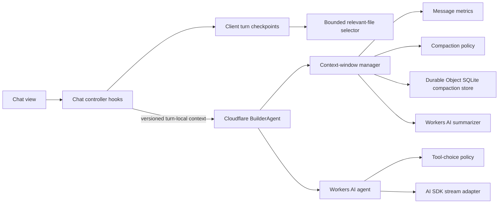

# Ghostbuild Architecture

Ghostbuild is a Cloudflare-native TanStack Start application. Cloudflare Workers host the app and API, Cloudflare Agents and Durable Objects own agent state, D1 stores relational state, R2 stores snapshots and compressed payloads, and Workers AI supplies generation and compaction.

## Module Shape

Features follow the same dependency direction:

```text
route or view
  -> controller or orchestration service
    -> domain policy / model
      -> repository or platform adapter
```

- Views render state and forward user events. Browser effects belong in a nearby `use…` controller hook.
- Orchestrators coordinate a use case but delegate persistence, policy, platform calls, and presentation.
- Policies and models are pure whenever possible and have focused unit tests.
- Repositories own D1, R2, Durable Object SQLite, or HTTP details.
- Platform adapters are the only modules that should know a vendor SDK's low-level API.
- Barrel/entry modules preserve stable imports but should contain little behavior.

Avoid importing a global store from a low-level service. Pass the narrow capabilities that service needs, as `ActionRunner`, `WorkbenchArtifactStore`, and the context-window manager do.

## Agent and Context Flow



The browser never truncates or decorates the durable user transcript. It selects relevant and modified files into a bounded, versioned, turn-local payload. Each transcript Agent owns one summary overlay in Durable Object SQLite. Immediately before generation, one model-input stage applies that overlay, injects turn-local context, prunes obsolete reasoning and completed tool-call details, includes the actual system prompts and active tool schemas, and estimates the resulting provider input. Above 100K tokens it uses Cloudflare's compact function with a Workers AI summarizer once, rebuilds the same input, and persists the new overlay. Summary failure stops the turn with a retryable error; an input that still cannot fit is rejected. Older transcript history is never silently dropped.

Key modules:

- `app/agents/builder-agent.ts`: Cloudflare Agent lifecycle and request composition.
- `app/lib/.server/llm/context-compaction.ts`: summary-overlay assembly, protected head/tail policy, and SDK compaction.
- `app/lib/.server/llm/context-compaction-store.ts`: Durable Object SQLite persistence adapter.
- `app/lib/.server/llm/model-input.ts`: the single post-pruning provider-input assembly, estimation, compaction, and budget gate.
- `app/lib/.server/llm/turn-context.ts`: server-only injection of bounded, turn-local workspace context.
- `app/lib/.server/llm/workers-ai-text.ts`: Workers AI text/summarization adapter.
- `ghostbuild-agent/ChatContextManager.ts`: browser checkpoint coordinator.
- `ghostbuild-agent/context-message-metrics.ts`: prompt sizing and cutoff calculation.
- `ghostbuild-agent/relevant-files-context.ts`: relevant-file selection and rendering.

## Transcript Ownership and Reconciliation

Each subchat generation has one transcript identity: `(agentName, subchatIndex, generation)`. The original transcript keeps the legacy `initialId` agent name; forks and rewinds use generation-specific names. The stores have deliberately different responsibilities:

| Responsibility                                                                    | Canonical store                                 | Materialized or supporting store                                 |
| --------------------------------------------------------------------------------- | ----------------------------------------------- | ---------------------------------------------------------------- |
| Model generation, streaming, and interrupted-turn recovery                        | `BuilderAgent` Durable Object transcript        | turn diagnostics and compaction state in the same Durable Object |
| Active transcript identity, generation head, ancestry, and reload/rewind pointers | D1 `chat_transcripts` and `chat_message_states` | none                                                             |
| Reload fallback, rewind seed, and sharing archive                                 | versioned compressed R2 message history         | D1 points to the retained R2 object                              |
| Generated project files at a chat checkpoint                                      | R2 WebContainer snapshot                        | D1 message state points to the snapshot                          |

Reconciliation is deterministic:

1. Reload resolves the active identity from D1 and asks that Durable Object for its transcript. A non-empty matching Durable Object transcript wins.
2. If a new generation has an empty Durable Object, reload reads the selected R2 history and performs one identity-checked seed. Seeding is accepted only while that Durable Object transcript is empty; it cannot replace live history.
3. Every Durable Object transcript change advances a monotonic revision and SHA-256 digest. The browser can prepare a backup only when its full local transcript hashes to the same checkpoint.
4. The Worker verifies the checkpoint against the Durable Object both before and after R2 upload, then advances D1 with compare-and-swap writes. A stale client receives a conflict and uploaded but unreferenced objects are deleted.
5. Rewind increments the selected subchat generation, allocates a new agent name, records its parent generation/revision, and copies only the chosen R2/snapshot pointer into a revision-zero state for that generation. A transition token binds the generation change, seed pointer, and chat pointer to the same atomic D1 batch.
6. Browser `setMessages` calls are local-only. They may switch the rendered subchat but never overwrite an existing Durable Object transcript. Recovery therefore continues from the Durable Object, not from a possibly stale browser cache.

R2 histories written before transcript envelopes remain readable as legacy message arrays. New writes use a versioned envelope containing the exact transcript checkpoint.

Key modules:

- `ghostbuild-agent/transcript.ts`: transcript identities, checkpoint schemas, and canonical digests.
- `app/agents/builder-agent.ts`: Durable Object checkpoint advancement, snapshot reads, and empty-generation seeding.
- `app/lib/cloudflare/data/transcript-repository.server.ts`: D1 transcript identity and lineage access.
- `app/lib/cloudflare/data/chat-storage-state-repository.server.ts`: D1 storage-state lookup, retention, and checkpoint compare-and-swap writes.
- `app/lib/cloudflare/data/chat-repository.server.ts`: stable chat persistence facade and chat-record creation/lookup.
- `app/lib/cloudflare/data.server.ts`: Durable Object/R2 verification and reload reconciliation.
- `app/lib/stores/startup/`: browser reload, digest validation, and backup coordination.
- `migrations/0010_transcript_reconciliation.sql`: generation, checkpoint, and ancestry schema.

## Agent Tool Contract

Browser-executed tools return a versioned envelope with an explicit success flag, a bounded summary, typed data, and exact coverage. A tool never silently cuts a result: `view`, file listing, literal search, and documentation lookup continue through their own revision-bound cursors. Each continuation recomputes the same query and rejects a cursor if the workspace, source file, documentation, or arguments changed. Pages are bounded by both item count and serialized size.

Filesystem discovery uses dedicated `listFiles`, `searchText`, and `view` capabilities instead of arbitrary shell output. `edit` can apply up to 20 non-overlapping exact replacements against one original file revision. Read-only calls may overlap; mutations, dependency changes, validation, and deployment are exclusive barriers.

Repository reacquisition remains lexical by design. `listFiles` supports bounded project-relative globs; `searchText` ranks literal matches using request keywords, definition/import shape, recent user edits, and content revisions; `view` reads only an explicit range. Binary files, generated route/type files, dependencies, vendor metadata, and build outputs are excluded by one retrieval policy. Retrieved paths and source are untrusted project data, and turn-local workspace context is injected only into the cloned model view.

A deterministic CI fixture keeps this choice honest: after more than 16 unrelated recent files push a build-repair target out of the recency-only context, lexical retrieval must recover the authoritative definition in one bounded page while the recency baseline misses it. Semantic indexing stays disabled until a model-backed evaluation shows higher end-to-end build-task success than this lexical baseline at acceptable latency and token cost.

Every completed build requires a full fixed-command `validateProject` pass. Validation hashes the workspace before and after its typecheck, lint, build, and preview smoke checks and refuses to certify a workspace that changed during the run. A successful full pass records a turn-local deployment receipt inside the action runner; model-supplied revision text cannot create that receipt. Failed validation and dependency operations expose typed, bounded diagnostic records instead of raw command logs; `getDiagnostics` continues only those records through narrowly scoped turn state. Raw process output remains in the terminal and developer logs. Signed-in deployment requires that trusted receipt for the exact exported revision, verifies the bytes again while capturing an immutable source snapshot, and then stops at the existing explicit production-approval boundary. Guest builds stop after validation and remain previewable.

Read-only explorer and verifier sub-agents are not part of the production runtime. A July 2026 paired GLM-5.2 evaluation
found equal factual success with roughly 2.05× latency and cost for the assisted path, so keeping dormant facet-agent
state and lifecycle code was not justified. See `scripts/evaluations/read-only-subagents-2026-07-16.md` for the measured
result and reproduction boundary.

Workers AI prefix caching remains provider-controlled. Ghostbuild supplies an opaque, transcript-generation-scoped
`x-session-affinity` value so consecutive turns are more likely to reach the replica holding their shared prefix. Static
system instructions remain first, tool definitions retain deterministic order, and turn-local project data is injected
into the latest user message. Exact model-visible changes therefore invalidate only the changed suffix; cache
availability never changes prompt construction or correctness. AI Gateway full-response caching is not used.

Finish telemetry records whether affinity was attempted and classifies a cache as `hit`, `miss`, or `unavailable` from
provider-reported cached tokens. It also records duration, a session-salted input fingerprint, and estimated cached-token
savings without logging prompt contents or affinity values. The July 2026 GLM-5.2 benchmark preserved suffix correctness
and reduced warm latency by 46–92%, but reported zero cached tokens; those samples remain honest misses with no claimed
cost saving. See `scripts/evaluations/prompt-cache-2026-07-16.md`.

Key modules:

- `ghostbuild-agent/tool-result.ts`: shared structured result and exact-coverage contract.
- `app/lib/runtime/action-runner/bounded-pagination.ts`: size-aware pages and revision-bound continuation cursors.
- `app/lib/runtime/action-runner/command.ts`: bounded, abortable fixed-command execution shared by validation flows.
- `app/lib/runtime/action-runner/diagnostics-store.ts`: turn-scoped typed continuation for non-recomputable operation diagnostics.
- `app/lib/runtime/action-runner/project-navigation.ts`: bounded project listing and literal search.
- `app/lib/runtime/action-runner/revision.ts`: shared content, query, and workspace revision hashing.
- `app/lib/runtime/action-runner/tool-execution-scheduler.ts`: read concurrency and exclusive barriers.
- `app/lib/runtime/action-runner/validate-project.ts`: revision-stable fixed validation pipeline.
- `app/lib/.server/llm/workers-ai-tools.ts`: tool registration and mutation/validation/deployment completion policy.

## Feature Boundaries

| Area            | Coordinator / view                     | Supporting modules                                                                      |
| --------------- | -------------------------------------- | --------------------------------------------------------------------------------------- |
| Chat            | `app/components/chat/Chat.tsx`         | session, agent, submission, history, retry, and tool-status hooks beside it             |
| Tool calls      | `app/components/chat/ToolCall.tsx`     | presentation policy and tool-result renderers                                           |
| Message input   | `app/components/chat/MessageInput.tsx` | controller hook and highlight overlay                                                   |
| Workbench       | `app/lib/stores/workbench.client.ts`   | artifact execution, editor/files, preview, terminal, export, and rebuild-policy modules |
| Editor          | `CodeMirrorEditor.tsx`                 | editor configuration, document synchronization, theme, language, and shared types       |
| File tree       | `FileTree.tsx`                         | pure tree model and node/context-menu rendering                                         |
| Preview         | `Preview.tsx`                          | navigation and device-resize hooks; thumbnail controller and upload adapter             |
| Cloudflare data | `app/lib/cloudflare/data.server.ts`    | auth, HTTP, object storage, repositories, chat service, and sharing service             |
| Runtime actions | `app/lib/runtime/action-runner.ts`     | file tools, package installation, docs lookup, deploy, errors, types, and tool dispatch |
| Backup sync     | `app/lib/stores/startup/history.ts`    | backup worker, sync policy, state, message persistence, and initialization hooks        |

## Adding or Changing a Feature

1. Put domain decisions in a model/policy module and test them without React or Cloudflare bindings.
2. Put D1/R2/SQLite/Workers AI access behind a repository or adapter.
3. Coordinate those pieces in a service, Agent, store facade, or controller hook.
4. Keep the route or component focused on input/output and rendering.
5. Pass narrow interfaces into lower layers instead of importing application singletons.
6. Run `pnpm run typecheck`, `pnpm run test`, `pnpm run lint`, `pnpm run knip`, and `pnpm run build`.
