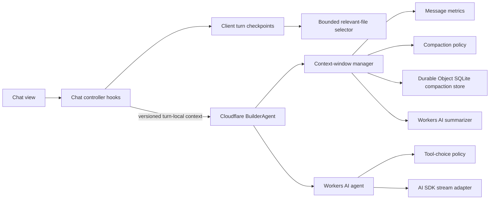

# Ghostbuild Architecture

Ghostbuild is a Cloudflare-native TanStack Start application. Cloudflare Workers host the app and API, Cloudflare Agents and Durable Objects own agent state, D1 stores relational state, R2 stores snapshots and compressed payloads, and Workers AI supplies generation and compaction.

## Module Shape

Features follow the same dependency direction:

```text
route or view
  -> controller or orchestration service
    -> domain policy / model
      -> repository or platform adapter
```

- Views render state and forward user events. Browser effects belong in a nearby `use…` controller hook.
- Orchestrators coordinate a use case but delegate persistence, policy, platform calls, and presentation.
- Policies and models are pure whenever possible and have focused unit tests.
- Repositories own D1, R2, Durable Object SQLite, or HTTP details.
- Platform adapters are the only modules that should know a vendor SDK's low-level API.
- Barrel/entry modules preserve stable imports but should contain little behavior.

Avoid importing a global store from a low-level service. Pass the narrow capabilities that service needs, as `ActionRunner`, `WorkbenchArtifactStore`, and the context-window manager do.

## Agent and Context Flow



The browser never truncates or decorates the durable user transcript. It selects relevant and modified files into a bounded, versioned, turn-local payload. `BuilderAgent` validates that payload, injects it into a cloned model view, loads the subchat-scoped compaction summary, compacts when the estimated model input exceeds 100K tokens, and uses Cloudflare's compact function with a Workers AI summarizer. Each successful compaction advances the readable summary in Durable Object SQLite. Immediately before generation, AI SDK pruning removes obsolete reasoning and completed tool-call details; a final conservative budget gate includes system prompts, tool schemas, tool choice, and the current turn, dropping only older model history or rejecting an irreducibly oversized current request.

Key modules:

- `app/agents/builder-agent.ts`: Cloudflare Agent lifecycle and request composition.
- `app/lib/.server/llm/context-window-manager.ts`: context preparation and retry orchestration.
- `app/lib/.server/llm/context-compaction.ts`: token threshold, protected head/tail policy, and fallback assembly.
- `app/lib/.server/llm/context-compaction-store.ts`: Durable Object SQLite persistence adapter.
- `app/lib/.server/llm/model-input-budget.ts`: final post-pruning model-input budget enforcement.
- `app/lib/.server/llm/turn-context.ts`: server-only injection of bounded, turn-local workspace context.
- `app/lib/.server/llm/workers-ai-text.ts`: Workers AI text/summarization adapter.
- `ghostbuild-agent/ChatContextManager.ts`: browser checkpoint coordinator.
- `ghostbuild-agent/context-message-metrics.ts`: prompt sizing and cutoff calculation.
- `ghostbuild-agent/relevant-files-context.ts`: relevant-file selection and rendering.

## Agent Tool Contract

Browser-executed tools return a versioned envelope with an explicit success flag, a bounded summary, typed data, and exact coverage. A tool never silently cuts a result: `view`, file listing, literal search, and documentation lookup continue through their own revision-bound cursors. Each continuation recomputes the same query and rejects a cursor if the workspace, source file, documentation, or arguments changed. Pages are bounded by both item count and serialized size.

Filesystem discovery uses dedicated `listFiles`, `searchText`, and `view` capabilities instead of arbitrary shell output. `edit` can apply up to 20 non-overlapping exact replacements against one original file revision. Read-only calls may overlap; mutations, dependency changes, validation, and deployment are exclusive barriers.

Every completed build requires a full fixed-command `validateProject` pass. Validation hashes the workspace before and after its typecheck, lint, build, and preview smoke checks and refuses to certify a workspace that changed during the run. Failed validation and dependency operations expose typed, bounded diagnostic records instead of raw command logs; `getDiagnostics` continues only those records through narrowly scoped turn state. Raw process output remains in the terminal and developer logs. Signed-in deployment accepts only the exact validated revision, verifies it again before and after capturing an immutable source snapshot, and then stops at the existing explicit production-approval boundary. Guest builds stop after validation and remain previewable.

Key modules:

- `ghostbuild-agent/tool-result.ts`: shared structured result and exact-coverage contract.
- `app/lib/runtime/action-runner/bounded-pagination.ts`: size-aware pages and revision-bound continuation cursors.
- `app/lib/runtime/action-runner/command.ts`: bounded, abortable fixed-command execution shared by validation flows.
- `app/lib/runtime/action-runner/diagnostics-store.ts`: turn-scoped typed continuation for non-recomputable operation diagnostics.
- `app/lib/runtime/action-runner/project-navigation.ts`: bounded project listing and literal search.
- `app/lib/runtime/action-runner/revision.ts`: shared content, query, and workspace revision hashing.
- `app/lib/runtime/action-runner/tool-execution-scheduler.ts`: read concurrency and exclusive barriers.
- `app/lib/runtime/action-runner/validate-project.ts`: revision-stable fixed validation pipeline.
- `app/lib/.server/llm/workers-ai-tools.ts`: tool registration and mutation/validation/deployment completion policy.

## Feature Boundaries

| Area            | Coordinator / view                     | Supporting modules                                                                      |
| --------------- | -------------------------------------- | --------------------------------------------------------------------------------------- |
| Chat            | `app/components/chat/Chat.tsx`         | session, agent, submission, history, retry, and tool-status hooks beside it             |
| Tool calls      | `app/components/chat/ToolCall.tsx`     | presentation policy and tool-result renderers                                           |
| Message input   | `app/components/chat/MessageInput.tsx` | controller hook and highlight overlay                                                   |
| Workbench       | `app/lib/stores/workbench.client.ts`   | artifact execution, editor/files, preview, terminal, export, and rebuild-policy modules |
| Editor          | `CodeMirrorEditor.tsx`                 | editor configuration, document synchronization, theme, language, and shared types       |
| File tree       | `FileTree.tsx`                         | pure tree model and node/context-menu rendering                                         |
| Preview         | `Preview.tsx`                          | navigation and device-resize hooks; thumbnail controller and upload adapter             |
| Cloudflare data | `app/lib/cloudflare/data.server.ts`    | auth, HTTP, object storage, repositories, chat service, and sharing service             |
| Runtime actions | `app/lib/runtime/action-runner.ts`     | file tools, package installation, docs lookup, deploy, errors, types, and tool dispatch |
| Backup sync     | `app/lib/stores/startup/history.ts`    | backup worker, sync policy, state, message persistence, and initialization hooks        |

## Adding or Changing a Feature

1. Put domain decisions in a model/policy module and test them without React or Cloudflare bindings.
2. Put D1/R2/SQLite/Workers AI access behind a repository or adapter.
3. Coordinate those pieces in a service, Agent, store facade, or controller hook.
4. Keep the route or component focused on input/output and rendering.
5. Pass narrow interfaces into lower layers instead of importing application singletons.
6. Run `pnpm run typecheck`, `pnpm run test`, `pnpm run lint`, `pnpm run knip`, and `pnpm run build`.
